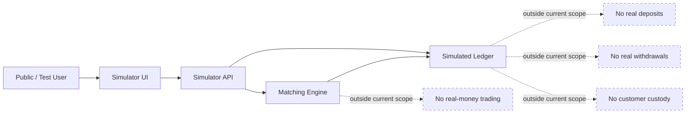
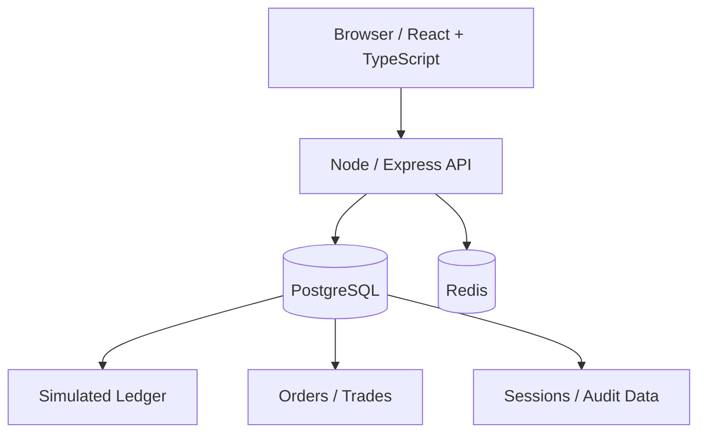
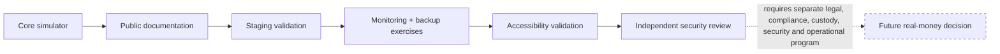

# Public Visuals

These diagrams are intentionally sanitized for the public NexaExchange showcase.

> **Scope:** NexaExchange is a simulated exchange engineering project. These visuals do not represent a live licensed exchange, customer custody service, real-money trading venue, or deposit/withdrawal system.

## Simulator scope boundary

## Sanitized architecture

No private hostnames, account identifiers, credentials, environment values, database URLs, SSH material, or internal incident details are included.

## Public engineering milestones

## Screenshot publication rule

Simulator screenshots can be added only after a separate public-release review confirms that they contain no credentials, private infrastructure identifiers, personal/customer data, sensitive URLs, session material, or language implying that real deposits, withdrawals, custody, or real-money trading are live.
